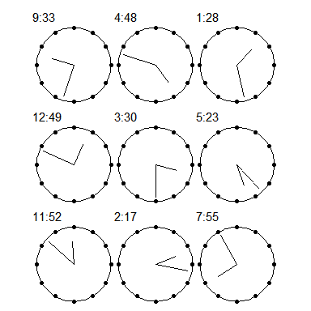
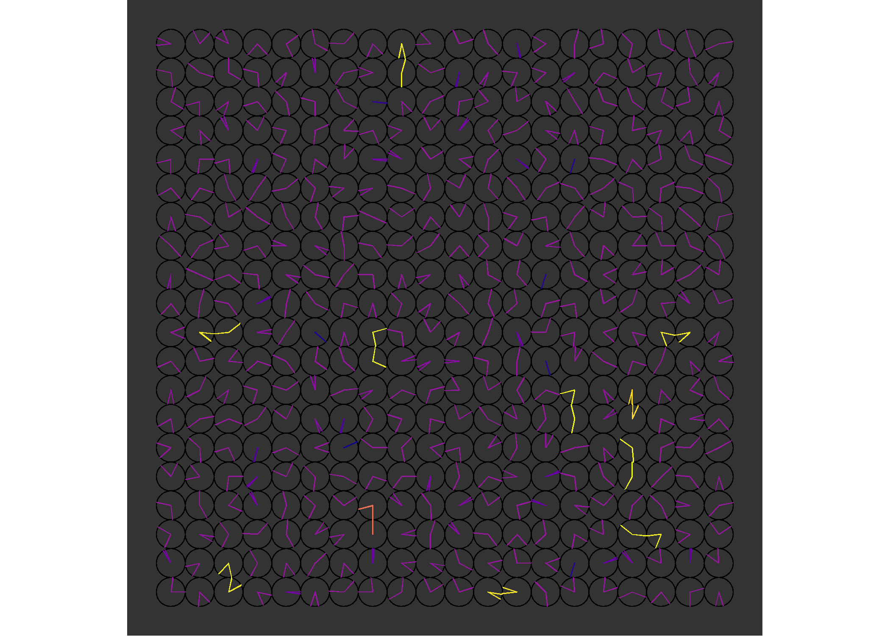
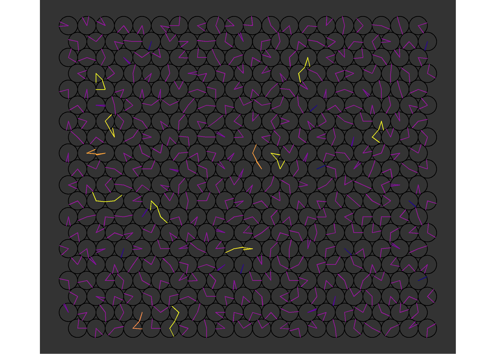

# clocks

-   Documenting an idea I had recently (probably in a dream).

    -   Visualise a wall of analogue clocks showing random times.
    -   Where the clock hands meet, join them together and differentiate
        them from the others, probably by colour
    -   Does it make cool connected patterns across the wall of clocks?

-   I’m no longer developing this - but wanted to document where I got
    to and share it for any potential future use!

-   As per usual, start by adding `{tidyverse}` and `{sf}` to the search
    path

``` r
library(tidyverse)
library(sf)
```

-   A function that returns a LINESTRING representation of the hands of
    a clock given the hour and minutes

``` r
#' Return hour and minute hands as a LINESTRING
#'
#' @param h Hour (1-12)
#' @param m Minute (1-60)
#' @param x0 x-origin of clock (default = 0) 
#' @param y0 y-origin of clock (default = 0)
#' @param h_length Multiplicative factor for hour hand length (default = 0.5) 
#' @param m_length Multiplicative factor for minute hand length (default = 0.5)
clock_hands <- function(h, m, x0=0, y0=0, h_length=0.5, m_length=0.5){
  
  # Compute angle (fraction of 2*pi) for h and m
  # Minute angle is 90 degrees minus the minutes/60 proportion of 2pi
  m_a <- (pi/2) - ((m/60) * (2*pi))
  # Hour angle  is 90 degrees minus the hour/12 proportion of 2pi, minus the minutes/60 proportion of 2pi/12
  h_a <- (pi/2) - ((h/12) * (2*pi)) - ((m/60)*((2*pi)/12)) 
  
  # Construct LINESTRING from the three coordinates
  # End of hour hand - clock origin - end of minute hand
  st_linestring(matrix(c(x0 + h_length*cos(h_a), y0 + h_length*sin(h_a),
                         x0, y0,
                         x0 + m_length*cos(m_a), y0 + m_length*sin(m_a)),
                       ncol=2, byrow = TRUE)) %>% 
    st_geometry()
}
```

-   Run some visual tests on the `clock_hands()` code

``` r
map2(sample(1:12, 9), 
     sample(1:60, 9),
     ~clock_hands(.x, .y, h_length = 0.6, m_length = 0.9) %>% 
       ggplot() + 
       geom_polygon(data = tibble(x = cos(seq(0,2*pi,l=100)),
                                  y = sin(seq(0,2*pi,l=100))),
                    aes(x, y), fill=NA, col=1)+
       geom_point(data = tibble(x = cos(seq(0,2*pi,l=13)),
                                y = sin(seq(0,2*pi,l=13))),
                  aes(x, y), fill=NA, col=1)+
       geom_sf() + 
       labs(subtitle = paste0(.x,":",.y))+
       theme_void()) %>% 
  patchwork::wrap_plots()
```

<!-- -->

## Static visualisations

### Square grid

-   Create a grid of random clock faces using `clock_hands()`

``` r
nx <- 20
ny <- 20
set.seed(1234)

clocks <-
  crossing(x=1:nx, y=1:ny) %>% 
  mutate(h = sample(1:12, size = nrow(.), replace = TRUE),
         m = sample(1:60, size = nrow(.), replace = TRUE)) %>% 
  mutate(g = pmap(list(x=x, y=y, h=h, m=m), clock_hands)) %>% 
  unnest(g) %>% 
  st_as_sf()
```

-   Buffer the clock hands and wrangle to individual polygons

``` r
my_buffer <- 0.02

clock_polys <-
  clocks %>% 
  st_buffer(my_buffer, endCapStyle = "ROUND") %>% 
  st_union() %>% 
  st_cast("POLYGON") %>%
  st_as_sf() %>% 
  mutate(a = st_area(x))
```

-   Create clock face circles to add to the visualisation.
    -   I make them as buffered LINESTRING so that they always render at
        the same size as the clock hands

``` r
a <- seq(0, 2*pi, l=200)

circles <- 
  clocks %>% 
  as_tibble() %>% 
  select(x, y) %>% 
  mutate(circle = map2(x, y, 
                       ~st_linestring(matrix(c(.x + cos(a)*0.5,
                                               .y + sin(a)*0.5),
                                             ncol = 2)) %>% 
                         st_geometry())) %>% 
  unnest(circle) %>% 
  st_as_sf() %>% 
  st_buffer(my_buffer)
```

-   Visualise

``` r
ggplot() + 
  geom_sf(data = circles, fill=1, col=NA)+  
  geom_sf(data = clock_polys, aes(fill = a), col=NA)+
  scale_fill_viridis_c(option = "plasma")+
  theme_void()+
  theme(legend.position = "",
        panel.background = element_rect(fill="grey20", color=NA))
```

<!-- -->

### Hexagonal grid

-   Same idea but on a hexagonal grid rather than square

``` r
set.seed(1234)

# Hexagon size (centre to point)
s <- 0.5/cos(pi/6)

# Width and height
w <- sqrt(3) * s
h <- 2 * s

# Distance on grid
vd <- h*(3/4)
hd <- w

clocks <-
  crossing(x = seq(from = 1, by = hd, l = nx),
           y = seq(from = 1, by = vd, l = ny)) %>%
  mutate(shove = rep(c(TRUE, FALSE), length.out = nrow(.)),
         x = case_when(shove ~ x+(hd/2), TRUE ~ x)) %>%
  mutate(h = sample(1:12, size = nrow(.), replace = TRUE),
         m = sample(1:59, size = nrow(.), replace = TRUE)) %>% 
  mutate(g = pmap(list(x=x, y=y, h=h, m=m), clock_hands)) %>% 
  unnest(g) %>% 
  st_as_sf()

my_buffer <- 0.02

clock_polys <-
  clocks %>% 
  st_buffer(my_buffer, endCapStyle = "ROUND") %>% 
  st_union() %>% 
  st_cast("POLYGON") %>%
  st_as_sf() %>% 
  mutate(a = st_area(x))

a <- seq(0, 2*pi, l=200)

circles <- 
  clocks %>% 
  as_tibble() %>% 
  select(x, y) %>% 
  mutate(circle = map2(x, y, 
                       ~st_linestring(matrix(c(.x + cos(a)*0.5,
                                               .y + sin(a)*0.5),
                                             ncol = 2)) %>% 
                         st_geometry())) %>% 
  unnest(circle) %>% 
  st_as_sf()

ggplot() + 
  geom_sf(data = circles %>% st_buffer(my_buffer), fill=1, col=NA)+  
  geom_sf(data = clock_polys, aes(fill = a), col=NA)+
  scale_fill_viridis_c(option = "plasma")+
  theme_void()+
  theme(legend.position = "",
        panel.background = element_rect(fill="grey20", color=NA))
```

<!-- -->

## Animation 1

-   Animation using the hexagonal grid approach
-   All clocks start at 12:00 and run at random rates
-   Code not run in this .Rmd file. The individual images are saved and
    animated outside of the R session with ImageJ

``` r
nx <- 8
ny <- 8

my_buffer <- 0.04

baseline_area <-
  clock_hands(12,30) %>% 
  st_buffer(my_buffer, endCapStyle = "ROUND") %>% 
  st_area()

# Hexagon size (centre to point)
s <- 0.5/cos(pi/6)
# Width and height
w <- sqrt(3) * s
h <- 2 * s
# Distance on grid
vd <- h*(3/4)
hd <- w

oclocks <-
  crossing(x = seq(from = 1, by = hd, l = nx),
           y = seq(from = 1, by = vd, l = ny)) %>%
  mutate(shove = rep(c(TRUE, FALSE), length.out = nrow(.)),
         x = case_when(shove ~ x+(hd/2), TRUE ~ x)) %>%
  # Define original starting time of each clock
  # and its rate and direction (negative is back in time!)
  mutate(
    om = 0,
    rate = runif(nrow(.), min = 0.0001, 2)
    ) %>%
  mutate(h = floor(om/60),
         m = om - (h*60)) %>%
  mutate(g = pmap(list(x=x, y=y, h=h, m=m), clock_hands)) %>%
  unnest(g) %>%
  st_as_sf()

a <- seq(0, 2*pi, l=200)
circles <- 
  oclocks %>% 
  as_tibble() %>% 
  select(x, y) %>% 
  mutate(circle = map2(x, y, 
                       ~st_linestring(matrix(c(.x + cos(a)*0.5,
                                               .y + sin(a)*0.5),
                                             ncol = 2)) %>% 
                         st_geometry())) %>% 
  unnest(circle) %>% 
  st_as_sf() %>% 
  st_buffer(my_buffer/2)


for(i in 1:(60*8)){
  
  clocks <-
    oclocks %>% 
    mutate(om = om + ((i-1)*rate)) %>% 
    mutate(h = floor(om/60),
           m = om - (h*60)) %>% 
    mutate(g = pmap(list(x=x, y=y, h=h, m=m), clock_hands)) %>% 
    unnest(g) %>% 
    st_as_sf()
  
  clock_polys <-
    clocks %>% 
    st_buffer(my_buffer, endCapStyle = "ROUND") %>% 
    st_union() %>% 
    st_cast("POLYGON") %>% 
    st_as_sf() %>% 
    mutate(a = st_area(x))
  
  ggplot() + 
    geom_sf(data = circles, fill=1, col=NA)+
    geom_sf(data = clock_polys, aes(fill = a), col=NA)+
    scale_fill_viridis_c(option = "plasma",
                         begin = 0.1,
                         limits=c(0, baseline_area*5), 
                         na.value = "green")+
   scale_x_continuous(limits = c(0, 9.5))+
    scale_y_continuous(limits = c(0, 8.06))+
    theme_void()+
    theme(legend.position = "",
          panel.background = element_rect(fill="grey20", color=NA))
  
  ggsave(paste0("animation/", i, ".png"), width=2.5, height=2.5, bg = "grey20")
}
```


## Animation 2

-   Animation using the hexagonal grid approach
-   All clocks start at a random time and run at random rates
-   Stop clocks when they intersect with another clock
-   Code not run in this .Rmd file. The individual images are saved and
    animated outside of the R session with ImageJ

``` r
nx <- 8
ny <- 8

my_buffer <- 0.04

baseline_area <-
  clock_hands(12,30) %>% 
  st_buffer(my_buffer, endCapStyle = "ROUND") %>% 
  st_area()

# Hexagon size (centre to point)
s <- 0.5/cos(pi/6)
# Width and height
w <- sqrt(3) * s
h <- 2 * s
# Distance on grid
vd <- h*(3/4)
hd <- w

oclocks <-
  crossing(x = seq(from = 1, by = hd, l = nx),
           y = seq(from = 1, by = vd, l = ny)) %>%
  mutate(shove = rep(c(TRUE, FALSE), length.out = nrow(.)),
         x = case_when(shove ~ x+(hd/2), TRUE ~ x)) %>%
  # Define original starting time of each clock
  # and its rate and direction (negative is back in time!)
  mutate(
    om = runif(nrow(.), 0, 60*12),
    rate = runif(nrow(.), min = 0.0001, 2)
    ) %>%
  mutate(h = floor(om/60),
         m = om - (h*60)) %>%
  mutate(g = pmap(list(x=x, y=y, h=h, m=m), clock_hands)) %>%
  unnest(g) %>%
  st_as_sf()

a <- seq(0, 2*pi, l=200)
circles <- 
  oclocks %>% 
  as_tibble() %>% 
  select(x, y) %>% 
  mutate(circle = map2(x, y, 
                       ~st_linestring(matrix(c(.x + cos(a)*0.5,
                                               .y + sin(a)*0.5),
                                             ncol = 2)) %>% 
                         st_geometry())) %>% 
  unnest(circle) %>% 
  st_as_sf() %>% 
  st_buffer(my_buffer/2)

for(i in 1:(60*8)){

  clocks <-
    oclocks %>% 
    mutate(om = om + (ifelse(i==1, 0, 1)*rate)) %>% 
    mutate(h = floor(om/60),
           m = om - (h*60)) %>% 
    mutate(g = pmap(list(x=x, y=y, h=h, m=m), clock_hands)) %>% 
    unnest(g) %>% 
    st_as_sf()
  
  clock_polys <-
    clocks %>% 
    st_buffer(my_buffer, endCapStyle = "ROUND")
  
  # For clock hands that intersect - set their rate to 0
  oclocks$rate[(clock_polys %>% st_intersects() %>% lengths()) > 1] <- 0
  # Update original minutes(om) with the time when they intersected
  oclocks$om <- (clocks$h*60) + clocks$m
  
  clock_polys <-
    clock_polys %>% 
    st_union() %>% 
    st_cast("POLYGON") %>%
    st_as_sf() %>% 
    mutate(a = st_area(x))
  
   ggplot() + 
    geom_sf(data = circles, fill=1, col=NA)+
    geom_sf(data = clock_polys, aes(fill = a), col=NA)+
    scale_fill_viridis_c(option = "plasma", 
                         begin = 0.1,
                         limits=c(0, baseline_area*7), 
                         na.value = "green")+
    scale_x_continuous(limits = c(0, 9.5))+
    scale_y_continuous(limits = c(0, 8.06))+
    theme_void()+
    theme(legend.position = "",
          panel.background = element_rect(fill="grey20", color=NA))
  
  ggsave(paste0("animation2/", i, ".png"), width=2.5, height=2.5, bg="grey20")
}
```


